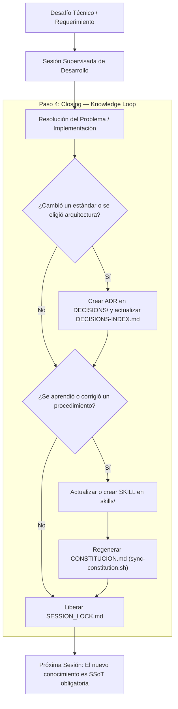

# Patrón del Círculo Virtuoso de Conocimiento (docs/patterns/knowledge-loop.md)

Cómo garantizar que cada sesión de desarrollo asistida por IA convierta la resolución de problemas en activos de conocimiento duraderos para todo el equipo.

---

## 1. El Problema de la Amnesia del Chat
En el paradigma convencional de interacción con modelos de lenguaje, el contexto es efímero. Si un ingeniero y un modelo resuelven un bug complejo, descubren un comportamiento no documentado de una API o definen un nuevo estándar de seguridad, ese conocimiento:
- Muere cuando la pestaña del navegador o la sesión del IDE se cierra.
- Debe ser re-explicado desde cero en la siguiente interacción.
- No queda disponible para el resto del equipo ni para futuros agentes.

---

## 2. El Círculo Virtuoso de Conocimiento

El protocolo SDD implementa un ciclo de retroalimentación cerrado:

## 3. Reglas de Preservación
1. **Regla de No Repetición**: Si un agente tuvo que corregir un error dos veces, el patrón de corrección debe incorporarse como una regla dura en `RULES/` o un anti-patrón en `ANTI-PATTERNS.md`.
2. **Sincronización Mandatoria**: Ningún PR se aprueba si modifica archivos en `skills/` sin haber ejecutado `./scripts/sync-constitution.sh`.
3. **Registro Histórico Permanente**: Las decisiones arquitectónicas son inmutables; no se borran, se superan formalmente mediante un nuevo ADR con referencia al anterior.

