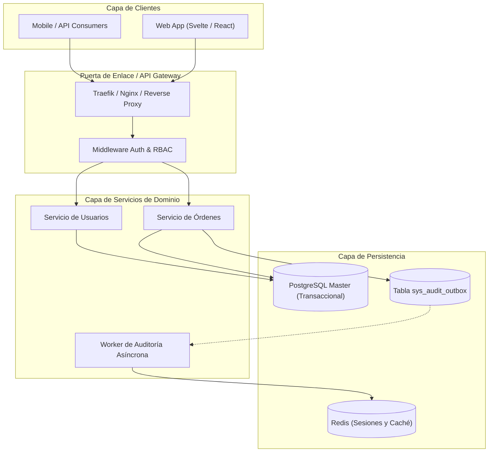
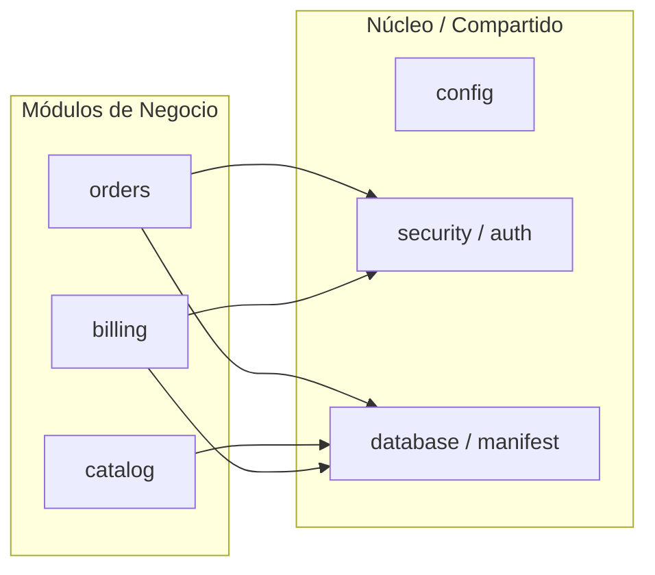

# Atlas de Arquitectura del Sistema

Este mapa topográfico representa el estado vivo del sistema y define las fronteras entre subsistemas, protocolos de comunicación y dependencias de persistencia.

---

## 1. Diagrama de Arquitectura de Alto Nivel

---

## 2. Mapa de Dependencias entre Módulos

---

## 3. Matriz de Propiedad de Tablas y Esquemas

| Tabla / Entidad | Dominio Propietario | Prefijo | Restricciones Específicas |
| :--- | :--- | :--- | :--- |
| `sys_users` | `security` | `sys_` | Password hash argon2id, UUIDv7 |
| `sys_audit_outbox` | `audit` | `sys_` | Append-Only, procesado por worker |
| `mov_orders` | `orders` | `mov_` | Transacción estricta, soft-delete |
| `cfg_system_params`| `config` | `cfg_` | Caché en Redis con TTL |

---

## 4. Política de Mantenimiento
- Este archivo se actualiza obligatoriamente en el paso 4 (*Closing*) del SOP v2 cuando se añade un nuevo módulo o se altera la interacción entre subsistemas.

