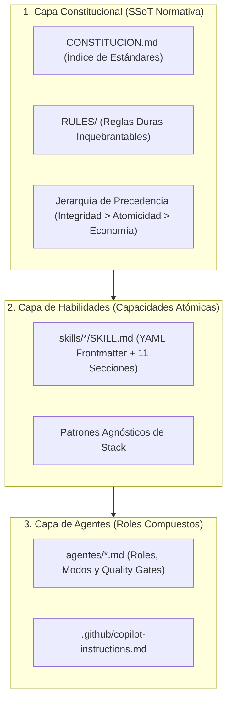

# Arquitectura Conceptual del Framework SDD

El framework **SDD (Spec-Driven Development)** para agentes de IA supervisados está fundamentado en una arquitectura modular de tres capas ortogonales articuladas por dos ejes transversales de gobernanza y conocimiento.

---

## 1. Las Tres Capas Fundamentales

### Capa 1: Constitución y Normativa (SSoT)
Es la fuente única de verdad legal y técnica del proyecto. Define los invariantes no negociables (D0 a D4), las reglas duras bajo advertencia `[!CAUTION]` y el índice de capacidades aprobadas en `CONSTITUCION.md`. Ningún agente puede contravenir los preceptos de esta capa.

### Capa 2: Habilidades Modulares (Skills)
Unidades discretas y reusables de conocimiento técnico empaquetadas con metadatos YAML. Cada skill define con precisión sus precondiciones, algoritmos de resolución, límites de autoridad y formato de salida.

### Capa 3: Agentes Compuestos (Roles Operativos)
Composiciones dinámicas que orquestan el contexto, las skills habilitadas y los modos operativos (`VALIDATE`, `GENERATE`, `EXPLAIN`, `ARCH-REVIEW`) para resolver problemas de ingeniería complejos.

---

## 2. Los Dos Ejes Transversales

### Eje A: Círculo Virtuoso de Conocimiento (SOP v2)
Garantiza que el aprendizaje derivado de cada interacción técnica no se pierda en la volatilidad de la sesión del chat, sino que se incorpore a la memoria del repositorio en forma de ADRs (`DECISIONS/`), mapas actualizados (`MAPS/`) o mejoras en skills (`skills/`).

### Eje B: Auditoría, Control y Concurrencia
Gobierna la interacción multi-agente mediante el registro atómico en `SESSION_LOCK.md`, la obligatoriedad de la marca de trazabilidad `// @ai-gen` y la verificación continua mediante pipelines de CI (`lint-skills.yml`).
