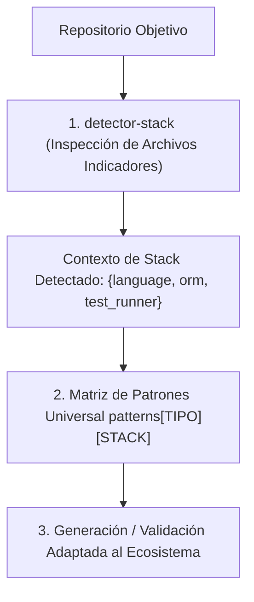

# Patrón de Habilidades Agnósticas de Stack (docs/patterns/agnostic-skills.md)

Cómo diseñar habilidades reutilizables que funcionen de manera transparente sobre múltiples stacks tecnológicos (Go, Node/TypeScript, Python, PHP, Rust) sin duplicar la lógica normativa.

---

## 1. Principio Fundamental
Una habilidad técnica debe codificar **conceptos e invariantes de ingeniería**, no atarse a la sintaxis contingente de un lenguaje particular.

El patrón separa la **inteligencia normativa** de la **materialización sintáctica**:

---

## 2. Los Cuatro Componentes del Patrón

### A. Base de Conocimiento Universal
Se mantienen catálogos de buenas prácticas y anti-patrones universales (e.g. transaccionalidad, inyección de dependencias, hashing seguro).

### B. Detector de Stack Desacoplado
El agente ejecuta la skill `detector-stack` inspeccionando los archivos indicadores en la raíz del proyecto:
- Presencia de `go.mod` -> Ecosistema Go.
- Presencia de `package.json` -> Ecosistema Node / TypeScript.
- Presencia de `pyproject.toml` -> Ecosistema Python.

### C. Matriz de Mapeo de Patrones
Se define un mapa de equivalencias conceptuales:

| Concepto Universal | Go | TypeScript / Node | Python |
| :--- | :--- | :--- | :--- |
| **Transacción DB** | `tx, err := db.BeginTx(...)` | `prisma.$transaction(...)` o `knex.transaction(...)` | `async with session.begin():` |
| **Hash de Claves** | `argon2id` (paquete crypto) | `argon2` / `bcrypt` | `passlib.hash.argon2` |
| **Testing** | `go test ./...` | `vitest run` / `jest` | `pytest` |
| **Linter** | `golangci-lint` | `eslint` / `biome` | `ruff check` |

### D. Salida Estructurada Normalizada
La habilidad emite el resultado en un formato universal JSON o Markdown estructurado, permitiendo que cualquier pipeline o herramienta consuma la recomendación sin importar el lenguaje.
