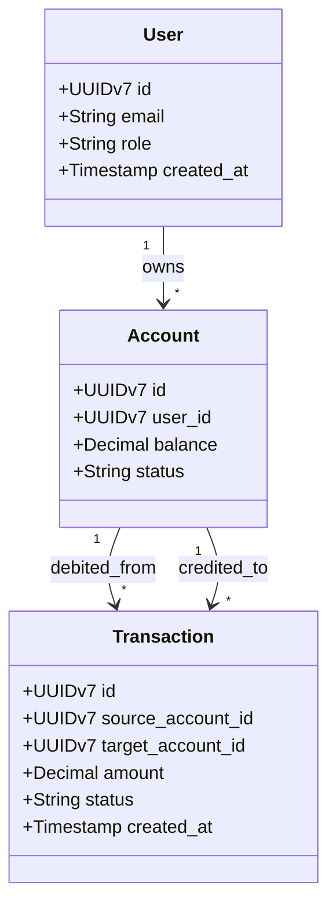

# Ejemplo de Contexto de Negocio Anonimizado (examples/context-example.md)

Este documento ilustra cómo se estructura un mapa mental y un catálogo de restricciones de negocio para un sistema de gestión transaccional, sirviendo como guía práctica para los equipos que adoptan el framework.

---

## 1. Mapa Conceptual de Dominio

---

## 2. Invariantes Críticas de Negocio
1. **Conservación de Saldo**: La suma de débitos y créditos en cualquier transacción transferencial debe balancear a cero de forma atómica.
2. **Cuentas Bloqueadas**: Una cuenta en estado `FROZEN` no puede emitir ni recibir fondos.
3. **Inmutabilidad Transaccional**: Los registros de `Transaction` nunca se actualizan; ante una reversión, se emite una transacción de compensación inversa.

---

## 3. Instrucción para el Agente
Al operar en módulos de este dominio, el agente debe:
- Cargar `Agent-DB` o `Agent-Dev`.
- Asegurar que toda transferencia se envuelva en `BEGIN` / `COMMIT` con nivel de aislamiento serializable o bloqueo pesimista en base de datos.
- Prohibir terminantemente el uso de tipos de coma flotante (`float32`/`float64`) para representar dinero; exigir `Decimal` o enteros en centavos.
